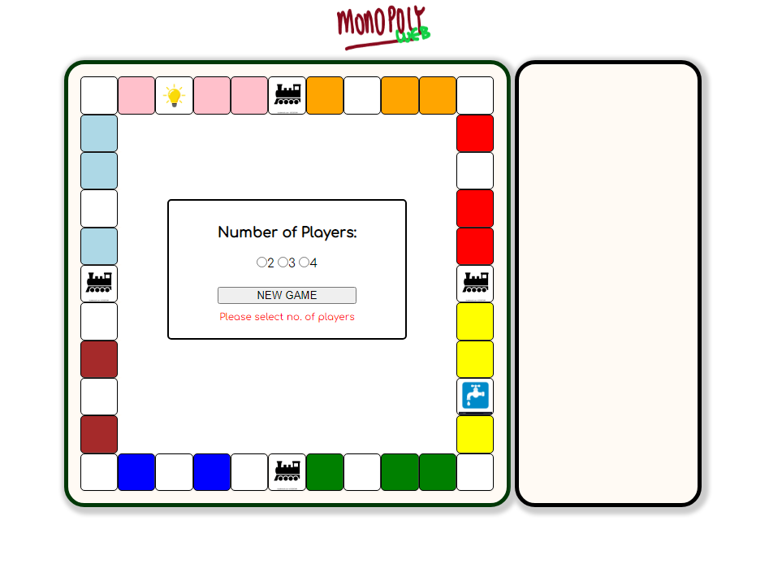

# Web Monopoly
Web Monopoly is based off the original game [Wikipedia: Monopoly(game)](https://en.wikipedia.org/wiki/Monopoly_(game)). This game was created for one of the projects for GA SEI-33. This was an attempt to build a web application game using HTML, CSS, DOM, and vanilla JavaScript.  

## Setup
The game can run on any modern web browsers. Open the html file using the web browser.

## Project Status
Completed. Might recreate using React.js / Angular.js

## Trivia
This game has been always a go-to among my friends and family. Recreating this game in a software version is something I have always thought about making, in hope to relive those moments.

